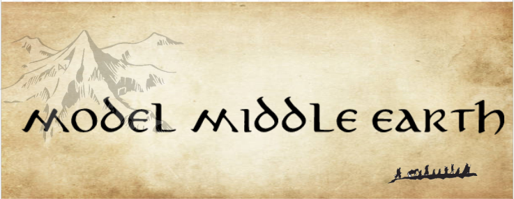

  

---

# ModelMiddleEarth
Digital explorations of J.R.R. Tolkien’s world — blending 3D artistry, coding, and security.  
From terrain maps to cityscapes (Minas Tirith, Rivendell, etc.), this project experiments with Blender, procedural generation, and AppSec-inspired workflows.

---

## Vision
- **3D Models:** Build and share detailed models of key Middle-earth locations.  
- **Procedural Generation:** Experiment with terrain + architecture generation using Python + Blender APIs.  
- **Atlas Concept:** Curated collection of “digital artifacts” — models, textures, and maps of Arda.  
- **Security Twist:** Sandbox builds, safe script handling, reproducible workflows for 3D projects.  

---

## Tech Stack
- **Blender + Python API** for 3D modeling and automation  
- **Open3D / Three.js** for rendering experiments  
- **Version Control:** GitHub Actions CI/CD for reproducible models  
- **Security:** Dependency scanning (Semgrep, Bandit), sandbox for Blender scripts  

---

## Roadmap
- [ ] Procedural terrain generator for Middle-earth landscapes  
- [ ] First city model: Minas Tirith (white city)  
- [ ] Add texture + lighting presets (day/night cycles)  
- [ ] Interactive web viewer with Three.js  
- [ ] Build “Atlas” of exported models  

---

## Inspiration
> “I wisely started with a map.” — J.R.R. Tolkien  

This project treats Middle-earth as a living dataset — one that can be explored, modeled, and secured like modern software.

 

  

